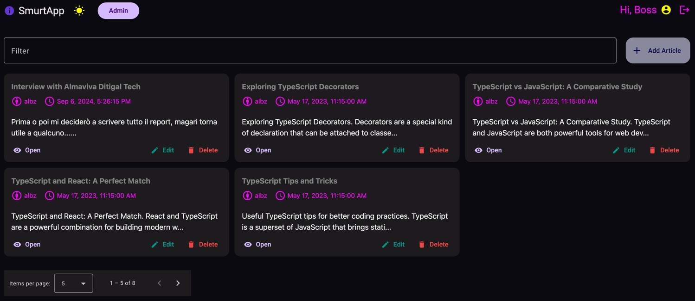
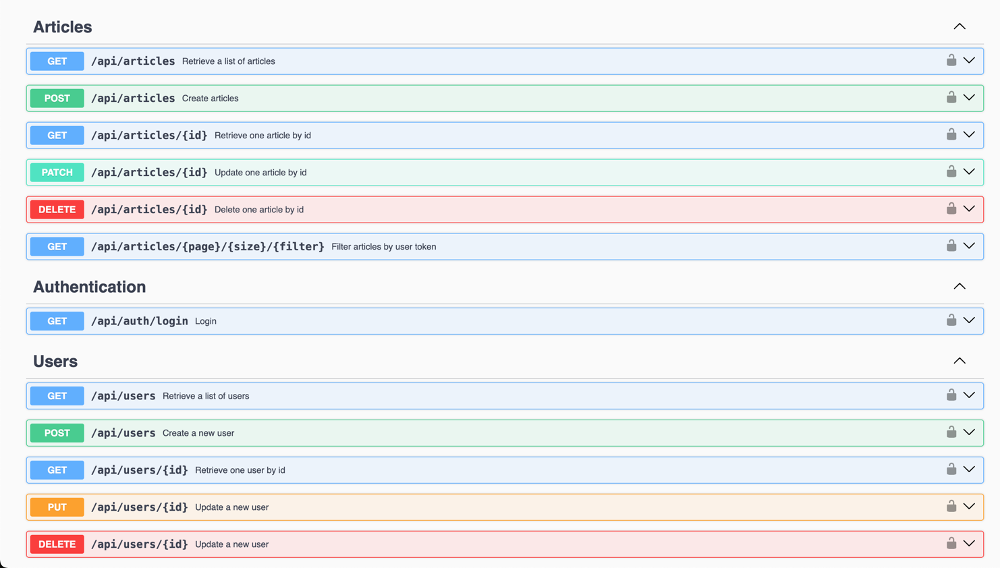

# Angular Crud exercise (0.1.0)
##### Made with last version of Angular

This project was generated with [Angular CLI](https://github.com/angular/angular-cli) version **18.0.1.**

## Development server

Run `ng serve` for a dev server. Navigate to `http://localhost:4200/`. The application will automatically reload if you
change any of the source files.


## Screenshots
<details>
<summary>Screens and Swagger</summary>

- 🤡 Empty list if you don't run the server, but before read the instructions.


Dark app theme (I know is terrible huauhahu UI)


Swagger present on endpoint `api-docs`


</details>

## Mongo instructions

If you want to use this server, you have look inside models: 

👉🏻 `server/models/*.js`

After creating models in your mongoDb instance.
Set the correct name of db through the `.env` file.

and the secret key for the jwt token.

```dotenv
DATABASE_URL=
DATABASE_PORT=
DATABASE_NAME=
SECRET_KEY=
```

You can rename `.env_sample` to `.env` and set the correct values.

Run `npm run server:start` to start the server.
 
## Code scaffolding

Run `ng generate component component-name` to generate a new component. You can also use
`ng generate directive|pipe|service|class|guard|interface|enum|module`.

## Build

Run `ng build` to build the project. The build artifacts will be stored in the `dist/` directory.

## Running unit tests

Run `ng test` to execute the unit tests via [Karma](https://karma-runner.github.io).

## TODO

- [x] Add filter for user articles
- [x] Add paginator on article-list
- [x] Add a better error handling
- [ ] Add test for the app 
- [x] Add CRUD for user (admin section)
- [x] Improve user session and model management
- [x] Add admin section for handling users and articles
- [ ] Add refresh token and retrieve password (EXTRA FEATURES)
 

## Author
🥷🏻 alBz


## Docker commands
Run `docker build -t my_angular_app:latest .`

and

`docker run -d -p 4200:80 my_angular_app` 

you can access to the app on `http://localhost:4200`

## License

This project is licensed under the MIT License 

## Hint 
You can use this project as a template for your own Angular projects or for prepare a technical interview.
